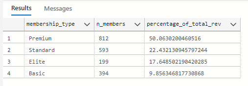

# MYGYM_Membership_Analysis 🏋️

## Project Overview

<p align="justify">
This project analyses the data of MYGYM, a fast-growing fitness center chain with multiple locations across California. MyGym offers a wide range of membership tiers, subscription models, and amenities, including group classes, personal training, and multi-location access. The goal as a Data Analyst at MYGYM is to help use membership data to uncover insights on how members engage with these services which will help in optimizing operations and designing  a well-targeted and effective membership offers.
</p>


## Data Sources
The data was gotten from Onyx Analytics monthly challenge for August. It has 25 fields of both facts and dimensional values and 1998 records.


## Tools
- Excel: Data normalization
- SQL: Data cleaning,manipulation and analysis

## Exploratory Data Analysis(EDA)
- Understand which member segments bring the most value
- Identify areas for pricing, subscription, or service optimization
- Improve customer experience through data-driven insights
- Optimize staffing and facility allocation across locations
- Explore trends in retention, usage, and upgrade behavior

## Analysis
-- Profitability
```sql
WITH
    Most_valuable
    AS
    (
        SELECT
            ISNULL(membership_type, 'Total') AS membership_type,
            COUNT(member_id)  AS  n_members,
            SUM(final_price)  AS revenue
        FROM
            MyGym_Fitness
        GROUP BY
           membership_type
    )
SELECT
    membership_type,
    n_members,
    CAST(revenue AS FLOAT) /
        (
            SELECT
        SUM(final_price)
    FROM
        MyGym_Fitness
        ) * 100 AS percentage_of_total_rev
FROM
    Most_valuable
ORDER BY
    percentage_of_total_rev DESC

```
### Query result



The Premium members(40% of the members population) generates the most revenue with 50% of the total revenue,followed by the Standard with 22% of total_revenue while the Elite and Basic are at the rare with approximately 18 and 10 percent respectively.


