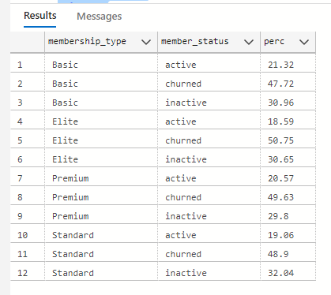

# MYGYM_Membership_Analysis 🏋️

## Project Overview

<p align="justify">
This project analyses the data of MYGYM, a fast-growing fitness center chain with multiple locations across California. MyGym offers a wide range of membership tiers, subscription models, and amenities, including group classes, personal training, and multi-location access. The goal as a Data Analyst at MYGYM is to help use membership data to uncover insights on how members engage with these services which will help in optimizing operations and designing  a well-targeted and effective membership offers.
</p>


## Data Sources
The data was gotten from Onyx Analytics monthly challenge for August. It has 25 fields of both facts and dimensional values and 1998 records.


## Tools
- Excel: Data normalization
- SQL: Data cleaning,manipulation and analysis

## Exploratory Data Analysis(EDA)
- Understand which member segments bring the most value
- Identify areas for pricing, subscription, or service optimization
- Improve customer experience through data-driven insights
- Optimize staffing and facility allocation across locations
- Explore trends in retention, usage, and upgrade behavior

&nbsp;


``` sql
CREATE VIEW Gymnalytics 
AS (SELECT 
    member_id,
    membership_type,
    age,
    visit_per_week,
    days_per_week,
    attend_group_lesson,
    avg_time_check_in,
    avg_time_check_out,
    uses_sauna,
    duration_in_gym_minutes,
    has_drink_subscription,
    personal_training,
    self_identified_gender,
    subscription_price,
    subscription_model,
    adjusted_price,
    discount_type,
    discount_rate,
    final_price,
    access_hours,
    home_gym_location,
    latitude,
    longitude,
    join_date,
    last_visit_date,
    personal_training_hours,
    multi_location_access
FROM 
    MyGym_Fitness
)
```
&nbsp;


I created a view to select columns needed for the analysis.

&nbsp;

### Context
<p align="justify">
Understanding customer churn is critical for any business. Although losing customers is inevitable, identifying and analyzing the root causes enables organizations to make informed, strategic decisions that could improve retention and long-term growth. For a fitness company like MyGym,where consistency of customers is key to achieving their goal of a smart and healthy body,I created a benchmark,considering members who has  been out of the gym for more than 30 days a churned customer.
</p>

```sql

WITH cte 
AS(SELECT 
    membership_type,
    member_id,
    join_date,
    last_visit_date,
    final_price,
    DATEDIFF(DAY,last_visit_date,(SELECT MAX(last_visit_date) FROM Gymnalytics)) AS date_count
FROM Gymnalytics
)
SELECT 
    CAST(COUNT(CASE WHEN date_count > 30 THEN 1 END) AS FLOAT)/COUNT(member_id)* 100 AS Churn_rate
 
FROM cte
```

### Query Output


The query shows that 49% of the customers had churn meaning thier last day of visit to the gym is over a month.

&nbsp;

### Profitability and Churn By Membership type

``` sql
WITH cte 
AS(SELECT 
    membership_type,
    member_id,
    join_date,
    last_visit_date,
    final_price,
    DATEDIFF(DAY,last_visit_date,(SELECT MAX(last_visit_date) FROM Gymnalytics)) AS date_count
FROM Gymnalytics
)
,
aggregation 
AS(SELECT 
    membership_type,
    COUNT(CASE WHEN date_count > 30 THEN 1 END) AS n_churned_members,
    COUNT(member_id) AS n_existing_members,
    SUM(final_price) AS revenue_per_type
FROM cte
GROUP BY membership_type
)

SELECT 
    membership_type,
    n_churned_members,
    n_existing_members,
    revenue_per_type /(SELECT SUM(final_price) FROM Gymnalytics) * 100 AS percent_of_total_revenue 
FROM aggregation
```

### Query Output


This query reveals that the Premium membership_type generates 50% of the gym revenue with 812 members out of which about 50% of them has also churned.

&nbsp;

The query below further reveals the statuses(active,inactive and churned) across all membership_type.
```sql
DECLARE @Last_day DATE;
SET @Last_day = (SELECT MAX(last_visit_date)FROM Gymnalytics);

WITH Segmentation
AS(SELECT
     member_id,
     membership_type,
     join_date,
     last_visit_date,
     DATEDIFF(DAY,last_visit_date,@Last_day) AS date_count  
FROM
    Gymnalytics
)
,
    Segmentation2 AS
(SELECT 
    membership_type,
    member_id,
    CASE WHEN date_count <= 10 THEN 'active'
         WHEN date_count > 10 AND date_count <= 30 THEN 'inactive'
         ELSE 'churned'
    END AS member_status
FROM 
    Segmentation
)
, 
     Segmentation3 AS
(SELECT 
    membership_type,
    member_status,
    COUNT(member_id) AS n_members
FROM 
    Segmentation2
GROUP BY 
    membership_type,member_status
)
,
     Type_total     AS
(SELECT 
    membership_type,
    COUNT(member_id) AS members
FROM 
    Gymnalytics
GROUP BY 
    membership_type)

SELECT 
    l.membership_type,
    member_status,
    ROUND(CAST(l.n_members AS FLOAT) /r.members * 100,2) AS perc
FROM 
    Segmentation3 AS l
JOIN 
    Type_total    AS r  ON l.membership_type = r.membership_type
ORDER BY 
    membership_type,member_status
```



### A deep dive into the pricing model to see if it impacts churn

```sql

WITH Pricing 
AS(SELECT 
      subscription_model,
      member_id,
      discount_type,
      final_price,
      subscription_price - final_price  AS discount_value,
      DATEDIFF(DAY,last_visit_date,(SELECT MAX(last_visit_date)FROM Gymnalytics)) AS date_count
   FROM 
      Gymnalytics
)

 SELECT 
    subscription_model,
    discount_type,
    SUM(discount_value) AS discount,
    ROUND(CAST(COUNT(CASE WHEN date_count > 30 THEN 1 END) AS FLOAT)/  COUNT(member_id)*100,2) AS perc_churned
FROM Pricing
GROUP BY subscription_model,discount_type
ORDER BY subscription_model
```


